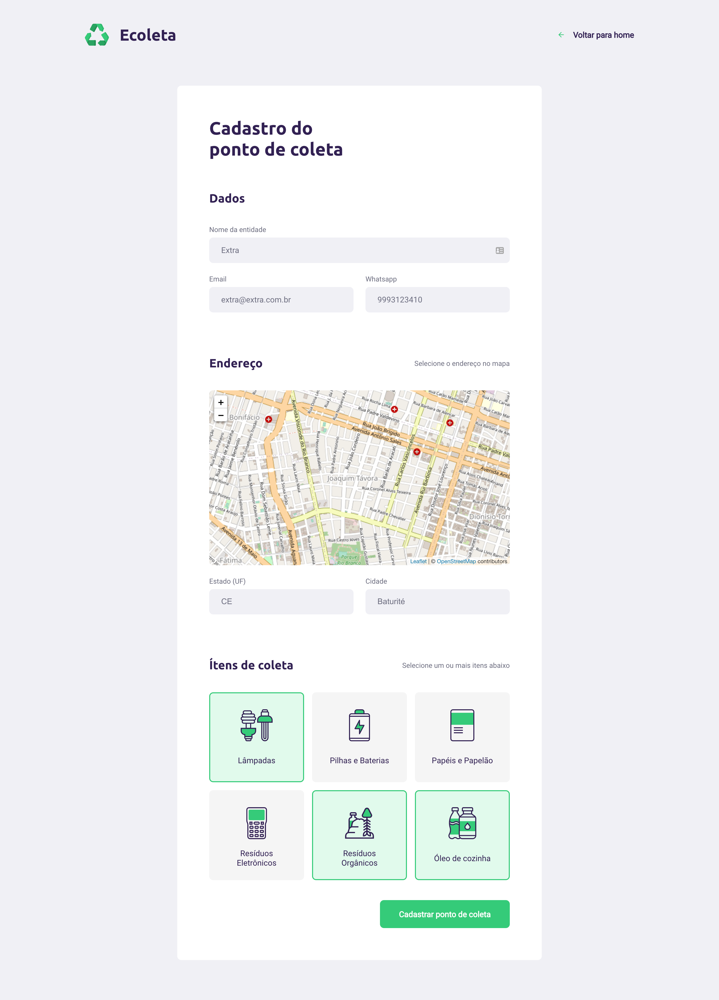

[](https://nodejs.org/en/) [](https://www.npmjs.com/)


# Ecoleta
 


## Tabela de Conteúdo
- <a href="#informações">Informações</a>
- <a href="#dependências-back-end">Dependências Back-End</a>
- <a href="#dependências-front-end">Dependências Front-End</a>
- <a href="#dependências-mobile">Dependências Mobile</a>
- <a href="#instalação">Instalação</a>
- <a href="#desenvolvedor">Desenvolvedor</a>

## Informações
O projeto feito em conjunto com as aulas da RocketSeat(Next Level Week). Usando Node.js e SQLite para o Back-End, React.js para o Front-End e React Native para o Mobile.

## Dependências Back-End
| Dependências em produção | Versão |
| ------------------------ | ------ |
| express | 4.17.1 |
| knex | 0.21.1 |
| sqlite3 | 4.2.0 |
| cors | 2.8.5 |

| Dependências em desenvolvimento | Versão |
| ------------------------------- | ------ |
| @types/express | 4.17.6 |
| ts-node | 8.10.2 |
| typescript | 3.9.3 |
| ts-node-dev | 1.0.0 |
| @types/express | 2.8.6 |

## Dependências Front-End
| Dependências em produção | Versão |
| ------------------------ | ------ |
| typescript | 3.7.2 |
| react-icons | 3.10.0 |
| react-router-dom | 5.2.0 |
| react-leaflet | 2.7.0 |
| leaflet | 1.6.0 |
| axios | 0.19.2 |

| Dependências em desenvolvimento | Versão |
| ------------------------------- | ------ |
| @types/react-router-dom | 5.1.5 |
| @types/react-leaflet | 2.5.1 |

## Dependências Mobile
| Dependências em produção | Versão |
| ------------------------ | ------ |
| expo-font | 0.1.0 |
| @expo-google-fonts/ubuntu | 0.1.0 |
| @expo-google-fonts/roboto | 0.1.0 |
| @react-navigation/native | 5.5.0 |


| Dependências em desenvolvimento | Versão |
| ------------------------------- | ------ |
| expo | 37.0.3 |

## Instalação

Use ```git clone https://github.com/iury0393/ecoleta_nlw.git ``` para clonar o repositório.

## Desenvolvedor

| Nome | Função | Email |
| ------ | ------ | ----- |
| Iury Vasconcelos | Desenvolvedor | iury0393@gmail.com |
